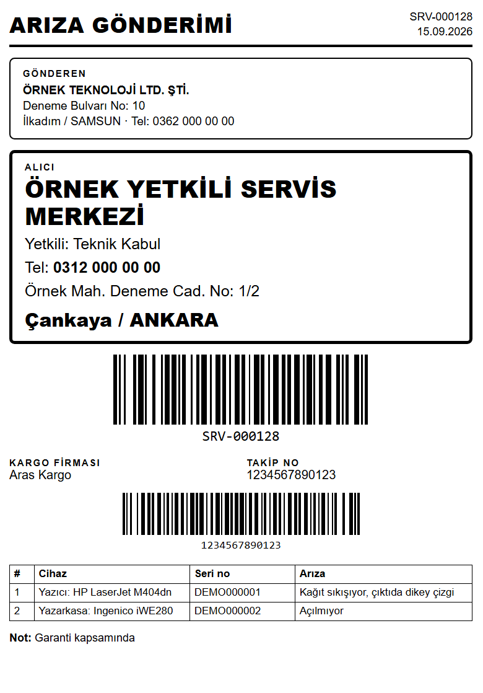
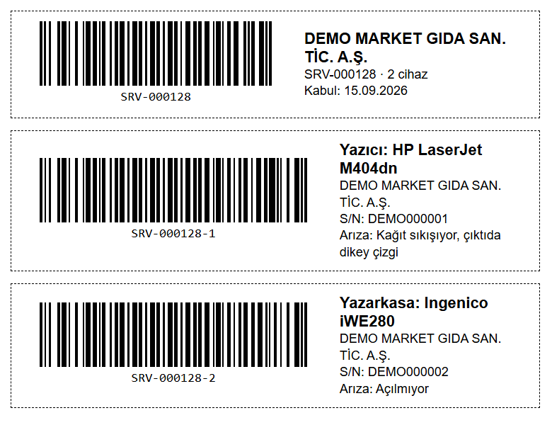
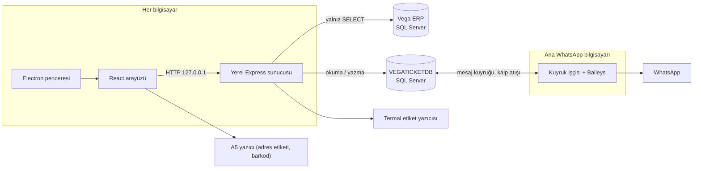

# Vega Müşteri İşlemleri

Vega ERP kullanan bir teknik servis firması için geliştirilmiş çok kullanıcılı masaüstü uygulaması. Uzaktan yapılan destek işlemlerini kaydeder, müşteriye WhatsApp ile bildirir, servise gelen cihazları etiketler ve arızaya gönderilen ya da kargoya verilen cihazları takip eder.

ERP veritabanına **hiç yazmaz**. Müşteri kartlarını ve cari bakiyeleri salt okunur kullanır, kendi verisini ayrı bir SQL Server veritabanında tutar.

**Teknolojiler:** Node.js · Express · SQL Server (mssql) · React 19 · Vite · Tailwind CSS 4 · Electron · Baileys (WhatsApp) · GitHub Releases ile otomatik güncelleme

---

## Öne çıkanlar

| Konu | Çözüm |
|---|---|
| ERP'ye dokunmadan entegrasyon | Vega tablolarına yalnız `SELECT`. Tablo adları dinamik olduğu için her ad desen ve `INFORMATION_SCHEMA` ile doğrulanır. |
| 40 bin carilik anlık liste | Kartlar bellekte tutulur. Tür/pasif değişikliği `CHECKSUM_AGG` imzasıyla 15 sn içinde yakalanır; bakiye TTL ile tazelenir. |
| Türkçe "Google mantığı" arama | Karakter normalizasyonu, trigram benzerliği ve sınırlı Levenshtein ile "şunu mu demek istediniz?" önerisi. |
| Çok kullanıcılı düzenleme | `ROWVERSION` ile iyimser kilitleme. Çakışan kayıt güncel haliyle döner, kimse başkasının değişikliğini ezmez. |
| Tek WhatsApp oturumu | QR yalnız seçilen ana bilgisayarda okutulur. Diğer bilgisayarlar mesajı DB kuyruğuna bırakır; ana bilgisayar `UPDLOCK, READPAST` ile sırayla gönderir. |
| Termal etiket | ZPL/TSPL ham komutları ya da Windows yazıcı sürücüsü (GDI+). Türkçe için CP857 kodlaması. |
| A5 adres etiketi ve barkod | Bağımlılıksız Code 128 üreticisi; çıktısı bağımsız bir barkod kütüphanesiyle birebir doğrulandı. |
| İsteğe bağlı PIN girişi | 4-6 haneli PIN, tuzlanmış `scrypt` özeti, yanlış denemede süreli kilit. |
| Şema yükseltme | Her açılışta idempotent migrasyon. Durum kısıtları tek listeden üretilir, eski kurulumlar veri kaybı olmadan yükselir. |

## Özellikler

### Müşteriler
- Büyük arama alanı ve Excel benzeri liste: tüm sütunlar sıralanır, başlık altındaki kutularla filtrelenir.
- Seçilen dönemdeki cari hareketlerinden borç/alacak durumu (`SUM(BORC) - SUM(ALACAK)`).
- Vega'daki özel kod 1'den müşteri türü: `ANLAŞMALI` (ve `ANTLAŞMALI`, `SÖZLEŞMELİ` gibi yazım türevleri) otomatik 12 ay, `YENİ MÜŞTERİ` için 1-12 ay elle süre.
- Yalnız aktif cariler listelenir.

### İşlem kaydı ve onay
- Yapılan işlem ve söylenen ücret kaydedilir; kayıt **Onay bekleyenler** listesine düşer, çift tıklamayla tamamlanır.
- Tamamlanan işlemler aylık görünür, hücre içinde düzenlenir; 4 saniyelik değişiklik yoklamasıyla tüm ekranlar güncel kalır.

### WhatsApp
- Ortak, değişkenli mesaj şablonu (`{firma}`, `{islem}`, `{ucret}`, `{tarih}`, `{kullanici}` …). Şablonu herkes düzenleyebilir.
- İşlem kaydedildiği anda mesaj kuyruğa alınır; 30 dakikada gönderilemeyen mesaj iptal edilir.
- Her ekranda bağlantı durumu ile oturumun hangi kullanıcıda ve bilgisayarda açık olduğu görünür.
- Gönderilmemiş mesaj düzenlenebilir ve yeniden gönderilebilir.
- Servis kaydından **isteğe bağlı** mesaj: tür seçilir (kabul edildi, teslime hazır, yetkili servise gönderildi, kargoya verildi, teslim edildi, genel), ortak şablon kayıt bilgileriyle (`{servisno}`, `{cihaz}`, `{kargo}`, `{takipno}` …) doldurulur, metin ve numaralar gönderimden önce değiştirilir. Hiçbir durum değişikliği kendiliğinden mesaj atmaz; kabul, teslime hazır, arıza ve kargo sonrasında yalnız "WhatsApp ile bildir" önerisi çıkar.
- Servis mesajları kayıt detayında durumuyla listelenir; sıradaki mesaj düzenlenir veya iptal edilir, gönderilemeyen mesaj yeniden gönderilir (ulaşan numaralar atlanır).

### Servis kabul, arıza ve kargo takibi
- Müşteri cihazıyla geldiğinde kabul kaydı açılır; her cihaz için termal etiket basılır. Termal etikete logo eklenir; logo ve yazı bloğunun yeri, genişliği ve yazı boyutu ayarlardan sürükleyerek ya da mm olarak değiştirilir.
- **Başka bilgisayardaki etiket yazıcısı:** yazıcının bağlı olduğu bilgisayar ayarlardan yazıcısını paylaşır; diğer bilgisayarlar onu hedef seçer ve "Etiket bas" işi ortak veritabanındaki kuyruğa (`ETIKETISLERI`) bırakır. Bilgisayarlar birbirine doğrudan bağlanmaz. Durum (sırada / basıldı / hata) ekranda izlenir, basılamayan iş tekrar gönderilir; 10 dakikada basılamayan iş iptal olur. Etiket bilgisayarında pencere kapansa da program tepside çalışır.
- Sekmeler: Serviste · Arızaya gönderilenler · Kargoya verilenler · Teslim edilenler · İptal edilenler.
- Arızaya gönderme / kargoya verme penceresi: alıcı adres defteri, Vega'dan müşteri adresi önerisi, kargo firması ve takip numarası. Gönderimler geçmişte ayrı satır olarak saklanır.
- **A5 adres etiketi** tasarlanabilir: gönderen ve alıcı kutuları, logo, "Dikkat kırılır" işareti, servis/kargo satırı, barkod ve cihaz listesi önizlemede sürüklenerek yerleştirilir; yatay veya dikey A5. Tasarım tüm bilgisayarlarda ortaktır.
- **A5 adres etiketi** ve **A5 barkod çıktısı**:

| A5 adres etiketi | A5 barkod kartları |
|---|---|
|  |  |

> Görsellerdeki firma, müşteri ve adres bilgileri kurgusaldır.

## Mimari



```text
server/   Express + mssql; Vega ve VEGATICKETDB için ayrı bağlantı havuzları
  lib/      iş kuralları (sözleşme, arama, cari listesi, etiket, PIN, WhatsApp kuyruğu)
  routes/   REST uçları
  tests/    node:test birim ve kaynak sözleşme testleri
client/   React + Vite + Tailwind
  lib/      ortak tablo sıralama/filtre, Code 128, A5 yazdırma
desktop/  Electron + electron-builder + electron-updater
```

Her bilgisayar kendi yerel sunucusunu çalıştırır ve yalnız `127.0.0.1:3010` üzerinde dinler. Paylaşılan durum (işlemler, servis kayıtları, WhatsApp kuyruğu, ortak ayarlar) SQL Server'dadır.

## Veri modeli (VEGATICKETDB)

| Tablo | İçerik |
|---|---|
| `TICKETLER` | İşlem, söylenen ücret, WhatsApp metni, onay durumu (`ONAY_BEKLIYOR` → `KAPALI`) |
| `TICKETLOG` | Kayıt ve düzenleme günlüğü |
| `CARISURELERI` | Yeni müşteriye tanımlanan 1-12 aylık süre |
| `SERVISKAYITLARI` | Servis kabulü; `SERVISNO` IDENTITY'den türetilen hesaplanmış kolon |
| `CIHAZLAR` | Kabuldeki cihazlar, arıza, etiket basım bilgisi |
| `SERVISGONDERIMLERI` | Arızaya gönderim / kargo geçmişi: alıcı, adres, kargo firması, takip no |
| `WHATSAPPAYARLARI` | Ana bilgisayar, oturumun açık olduğu kullanıcı, bağlantı kalp atışı |
| `WHATSAPPMESAJLARI` | Merkezi gönderim kuyruğu ve deneme/hata/iptal durumu; işlem kaydı (`TICKETID`) veya servis kaydı (`SERVISID`) mesajı |
| `WHATSAPPMESAJAYARLARI` | Ortak mesaj şablonu |
| `ORTAKAYARLAR` | Tüm bilgisayarların paylaştığı ayarlar (etiketteki gönderen, A5 etiket tasarımı, servis mesaj şablonları) |
| `ETIKETYAZICILARI` | Yazıcısını paylaşan bilgisayarlar, kalp atışı ve önizleme için yayımlanan etiket düzeni |
| `ETIKETISLERI` | Başka bilgisayara gönderilen etiket baskı kuyruğu (bekliyor / basılıyor / basıldı / hata / iptal) |
| `KULLANICILAR` | Kullanıcılar ve isteğe bağlı PIN özeti |

Vega tarafında yalnız `TBLCARI` (müşteri kartı), `TBLCARIHAREKETLERI` (dönem bakiyesi), `TBLCARIKODTAN`, `TBLFIRMA` ve `TBLDONEM` okunur. Firma ve dönem kurulum ekranından seçilir. Şema kanıtları: [SEMA-DOGRULAMA.md](SEMA-DOGRULAMA.md).

## API özeti

| Uç | İşlev |
|---|---|
| `GET /api/cari/liste` | Sayfalı müşteri listesi; `sirala`, `yon`, `kod`, `ad`, `tur`, `borc`, `sure` filtreleri |
| `GET /api/cari/ara?q=` | Türkçe duyarlı, yazım hatası toleranslı arama |
| `GET /api/cari/:ind` | Müşteri kartı, bakiye, süre ve tamamlanan işlemler |
| `PUT` / `DELETE /api/cari/:ind/sure` | Yeni müşteri süresi |
| `GET /api/ticket?durum=&ay=` | Onay bekleyen veya aylık tamamlanan işlemler |
| `POST /api/ticket` | İşlem kaydı + WhatsApp kuyruğu |
| `POST /api/ticket/:id/onayla` | Onaylayıp tamamlananlara taşıma |
| `PATCH /api/ticket/:id` | İşlem metni / ücret (`RV` zorunlu) |
| `PATCH /api/ticket/:id/whatsapp` | WhatsApp metnini düzenleme |
| `GET /api/ticket/degisiklikler` | Çok kullanıcılı canlı değişiklikler |
| `GET /api/servis?grup=` | `acik`, `ariza`, `kargo`, `teslim`, `iptal`, `tumu` listeleri ve adetler |
| `POST /api/servis` | Servis kabulü |
| `POST /api/servis/:id/gonderim` | Arızaya gönderme / kargoya verme (durum + gönderim tek işlemde) |
| `PATCH /api/servis/gonderim/:id` | Takip no gibi sonradan belli olan bilgiler |
| `GET /api/servis/gonderim/adresler` | Daha önce kullanılan alıcılar |
| `GET /api/servis/:id/musteri-adres` | Vega kartından müşteri adresi |
| `GET` / `POST /api/servis/gonderen` | Etiketteki ortak gönderen bilgisi |
| `GET` / `POST /api/servis/adres-etiketi/tasarim` | A5 adres etiketi yerleşimi ve logo |
| `GET` / `POST /api/servis/whatsapp/sablonlar` | Servis mesaj türleri ve ortak şablonları |
| `GET /api/servis/:id/whatsapp/taslak` | Kayıt bilgileriyle doldurulmuş metinler ve numara adayları |
| `POST /api/servis/:id/whatsapp` | Servis kaydından WhatsApp mesajını kuyruğa alma |
| `PATCH /api/servis/whatsapp/:mesajId` · `POST …/tekrar` · `POST …/iptal` | Servis mesajını düzenleme, yeniden gönderme, iptal |
| `POST /api/etiket/bas` | Cihaz etiketlerini termal yazıcıya basma; hedef başka bilgisayarsa kuyruğa bırakma (202) |
| `GET /api/etiket/paylasilanlar` · `GET /api/etiket/paylasilan` | Yazıcısını paylaşan bilgisayarlar ve etiket düzeni |
| `POST /api/etiket/uzak-dene` | Seçilen etiket bilgisayarına deneme etiketi |
| `GET /api/etiket/is/:id` · `POST …/tekrar` | Uzak baskı işinin durumu, basılamayan işi yeniden sıraya alma |
| `GET /api/whatsapp/durum` | Bağlantı, ana bilgisayar ve oturum kullanıcısı |
| `GET` / `POST /api/whatsapp/sablon` | Ortak mesaj şablonu |
| `POST /api/whatsapp/gonder` | Başarısız bildirimi yeniden gönderme |
| `GET /api/kullanici/liste` · `POST /api/kullanici/giris` · `POST /api/kullanici/pin` | Kullanıcı seçimi, PIN girişi, PIN yönetimi |

## Geliştirme

```bash
npm install
npm install --prefix server
npm install --prefix client
npm install --prefix desktop

npm run dev              # sunucu (3010) + Vite arayüzü (5180)
npm test --prefix server # 99 test
npm run build --prefix client
npm run dist             # Windows kurulum dosyası → dist/
```

`WHATSAPPMESAJLARI` tablosunda filtreli tekil indeks bulunduğundan tabloya elle `sqlcmd` ile yazarken `-I` (QUOTED_IDENTIFIER ON) verin.

İlk açılışta kurulum ekranından SQL Server bağlantısı, firma, dönem ve kullanıcı seçilir; `VEGATICKETDB` yoksa oluşturulur. Bağlantı ayarı ve makineye özel WhatsApp oturumu `%APPDATA%/vega-ticket-desktop` altında tutulur, depoya girmez.

## Sürüm yayınlama ve otomatik güncelleme

Kurulu uygulama açılıştan sonra herkese açık `saidbayraqtars/vega-ticket-sistem-releases` deposunu kontrol eder, yeni sürümü arka planda indirir ve kullanıcı onayıyla kurar.

```bash
# dört package.json sürümünü yükselt, RELEASE-NOTES-x.y.z.md yaz
npm run release   # GitHub yazma yetkili GH_TOKEN gerekir
```

Yayın betiği tag ve release kaydını hazırlar, testleri çalıştırır, arayüzü derler ve Electron kurulumunu yükler. Sürüm notları `RELEASE-NOTES-*.md` dosyalarındadır.
